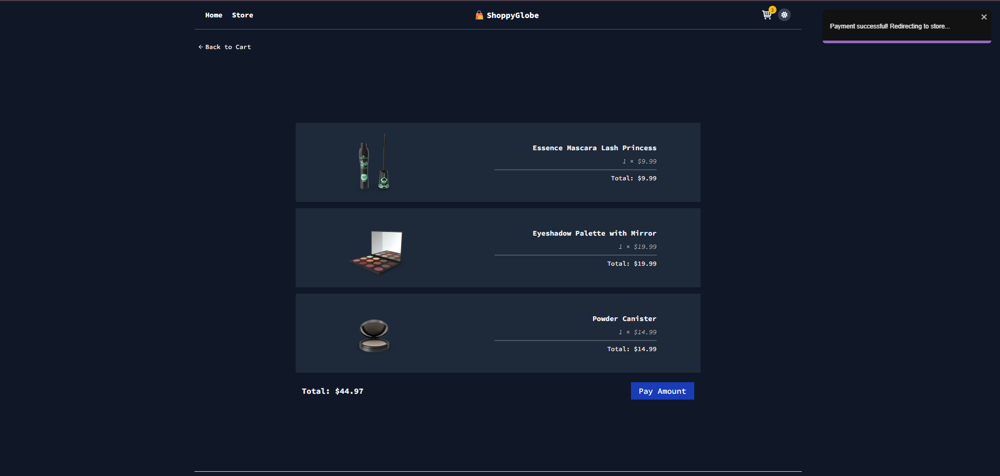
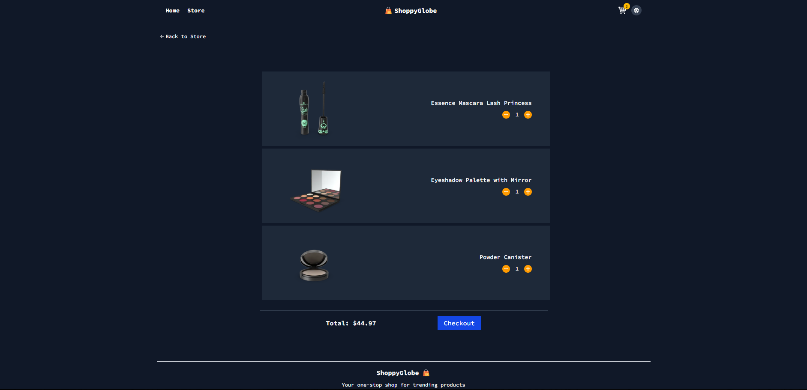
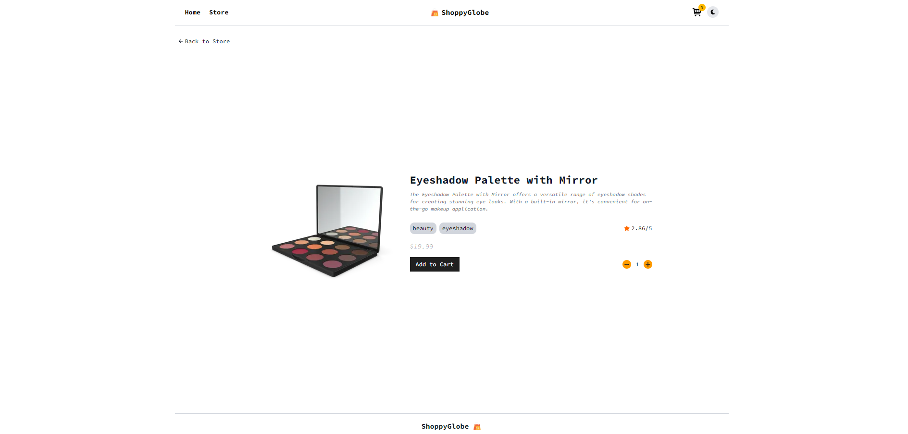
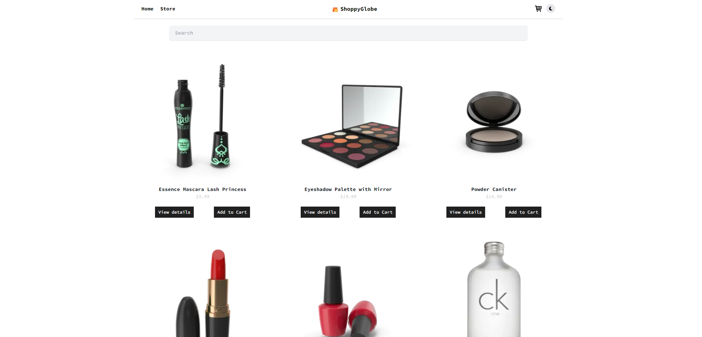
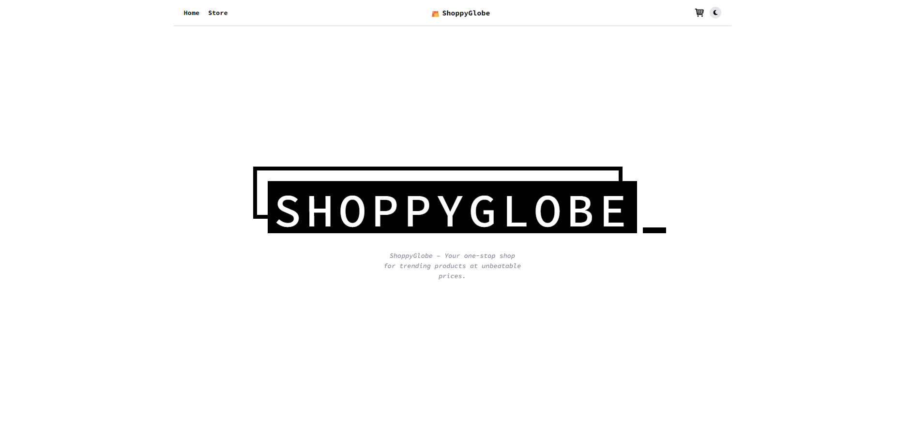

# ShoppyGlobe

**ShoppyGlobe** is a modern, responsive e-commerce web application built using React, Redux, and Tailwind CSS. It offers a seamless shopping experience with features like product browsing, detailed product views, cart management, dark mode, and a smooth checkout flow.

---

## Features

- **Home Page** with featured products
- **Product Listing** with grid layout
- **Product Details** with tags, ratings, and image fallback
- **Cart Management** (add/remove/adjust quantity)
- **Dark Mode Toggle**
- **Checkout Page**
- Lazy loading for optimized performance
- State management via **Redux Toolkit**
- Toast notifications for user actions
- Fully responsive design using **Tailwind CSS**
- Error handling for missing products or broken images

---

## Tech Stack

- **Frontend:** React, Tailwind CSS
- **Routing:** React Router
- **State Management:** Redux Toolkit
- **Icons:** React Icons
- **Notifications:** React Toastify

---

## Screenshots



---



---



---



---



---

## Folder Structure

```bash
src/
├── components/
│ ├── Cart.jsx
│ ├── CartItem.jsx
│ ├── Checkout.jsx
│ ├── Footer.jsx
│ ├── Header.jsx
│ ├── HomePage.jsx
│ ├── Loading.jsx
│ ├── NotFound.jsx
│ ├── ProductDetail.jsx
│ ├── ProductItem.jsx
│ └── ProductList.jsx
├── utils/
│ ├── appStore.js
│ ├── cartSlice.js
│ ├── productsSlice.js
│ ├── route.js
│ └── useFetch.js
├── assets/
│ └── fallback.png
├── context/
│ └── ThemeContext.jsx
├── index.css
├── main.jsx
└── App.jsx
```

---

## Setup Instructions

1. **Clone the repository**

```bash
git clone https://github.com/aayush-joshi1006/e-commerce
cd shoppyglobe
```

2. Install dependencies

```bash
npm install
```

4. Run the development server

```bash
npm run dev
```

5. Build for production

```bash
npm run build
```

6. Future Enhancements

- Product search & filters

- Authentication (Login/Register)

- Persistent cart (localStorage or backend)

- Payment integration

- Admin dashboard for product management

---

## Author

Aayush Joshi

aayushjoshi1006@gmail.com

---

#### Project link:- [https://github.com/aayush-joshi1006/e-commerce](https://github.com/aayush-joshi1006/e-commerce)

---

## License

This project is licensed under the MIT License.

---

Your one-stop shop for trending products at unbeatable prices.” — ShoppyGlobe
