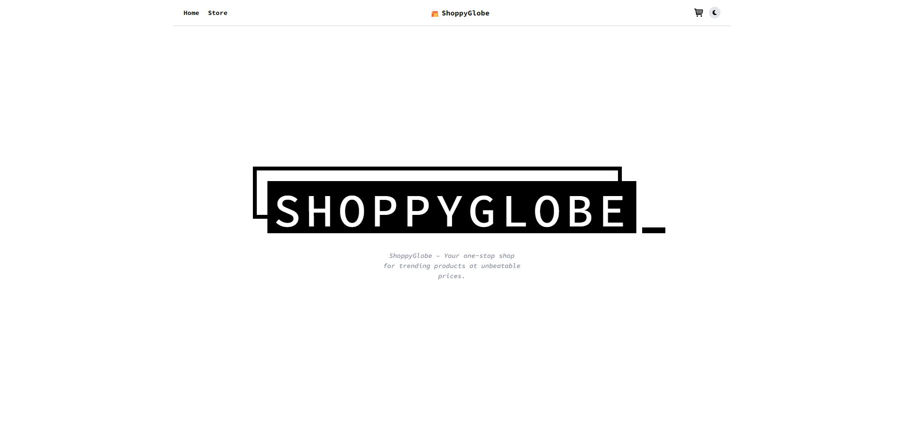
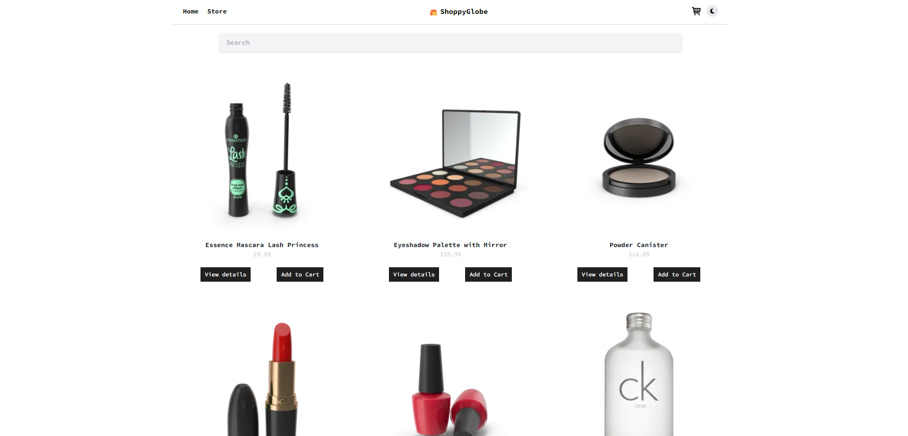
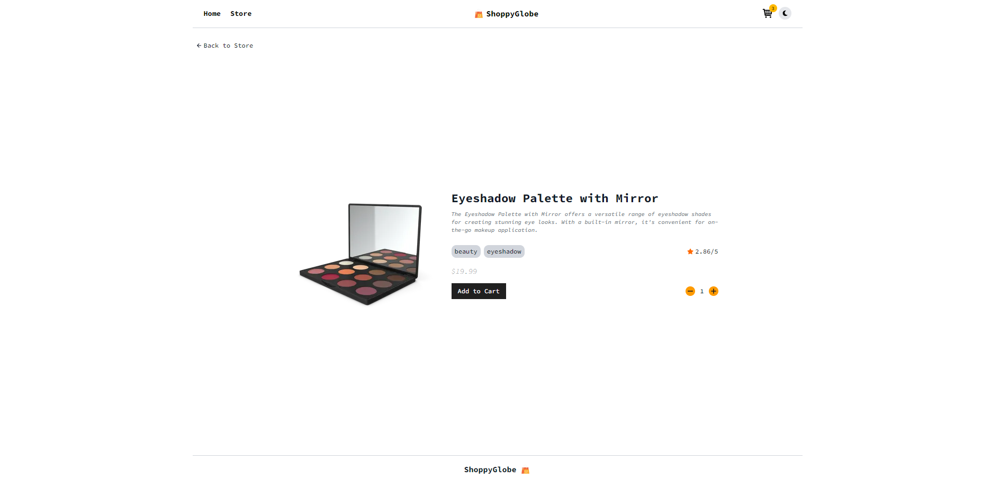
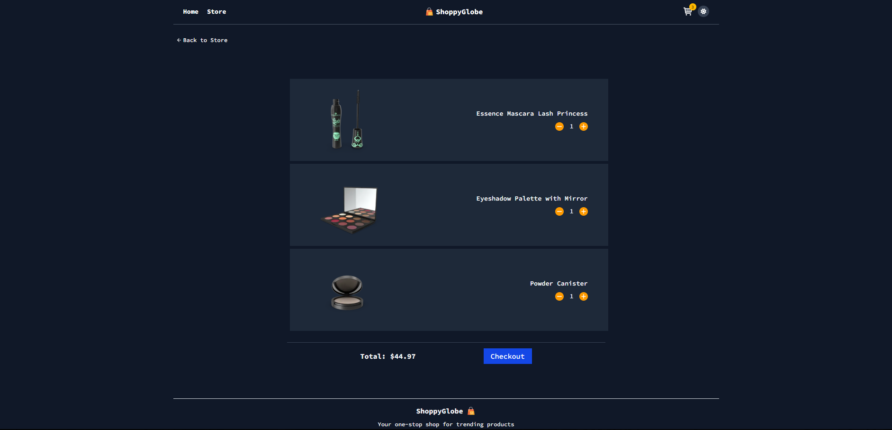
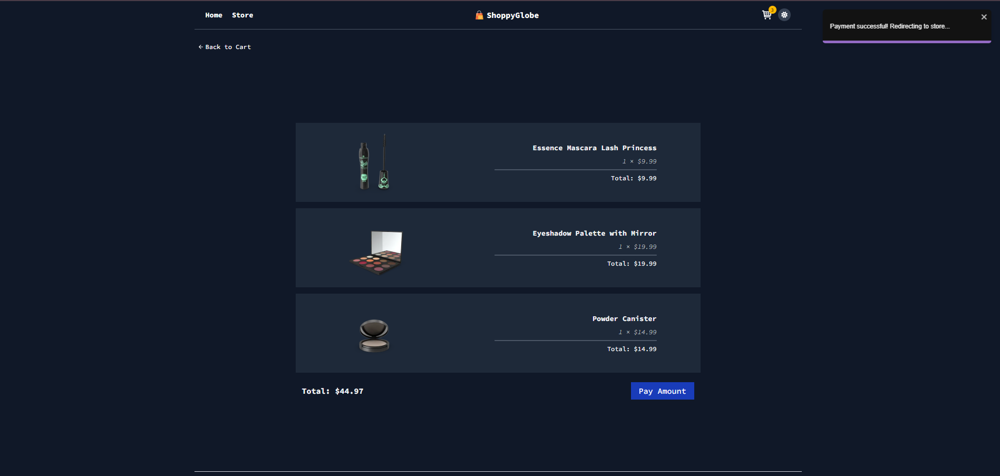

# 🛒 ShoppyGlobe

**ShoppyGlobe** is a full-stack modern e-commerce web application built with the **MERN** stack. It offers a seamless shopping experience with product browsing, user authentication, cart management, checkout, and more.

---

## 🚀 Features

- 🏠 Home page with featured products
- 🛍️ Product listing with grid layout
- 🔍 Product details with image fallback and tags
- 🛒 Add to cart / remove / quantity adjustment
- 🌙 Dark mode toggle using context API
- 🔐 Authentication: Login, Register, Logout
- ✅ Protected routes and buttons (e.g., Cart, Add to Cart)
- 🧾 Checkout page (basic implementation)
- 🍞 Toast notifications for user feedback
- ⚡ Lazy loading for performance
- 📱 Fully responsive (Tailwind CSS)
- 🛡️ Secure JWT-based user sessions (with cookies)

---

## 🧱 Tech Stack

### 🖥️ Frontend

- **React.js**
- **Redux Toolkit**
- **Tailwind CSS**
- **React Router DOM**
- **React Icons**
- **React Toastify**

### 🌐 Backend

- **Node.js**, **Express.js**
- **MongoDB**
- **Mongoose**
- **JWT** for Authentication
- **Cookie-based sessions**

---

## Screenshots



---



---



---



---



---

## Folder Structure

```bash
ecommerce
├── backend/
│ ├── config/
│ │  └──db.js
│ ├── Controller/
│ │  ├──auth.controller.js
│ │  ├──cart.controller.js
│ │  └──products.controller.js
│ ├── middleware/
│ │  └──auth.middleware.js
│ ├── Model/
│ │  ├──user.model.js
│ │  ├──cart.model.js
│ │  └──products.model.js
│ ├── Routes/
│ │  ├──auth.routes.js
│ │  ├──cart.routes.js
│ │  └──products.routes.js
│ ├── utils/
│ │  └──generateToken.js
│ └── server.js
src/
├── components/
│ ├── Cart.jsx
│ ├── CartItem.jsx
│ ├── Checkout.jsx
│ ├── Footer.jsx
│ ├── Header.jsx
│ ├── HomePage.jsx
│ ├── Loading.jsx
│ ├── NotFound.jsx
│ ├── ProductDetail.jsx
│ ├── ProductItem.jsx
│ ├── Login.jsx
│ ├── SignUp.jsx
│ ├── PrivateRoute.jsx
│ └── ProductList.jsx
├── utils/
│ ├── appStore.js
│ ├── cartSlice.js
│ ├── cartAPI.js
│ ├── productsSlice.js
│ ├── route.js
│ ├── userSlice.js
│ └── useFetch.js
├── assets/
│ └── fallback.png
├── context/
│ └── ThemeContext.jsx
├── index.css
├── main.jsx
└── App.jsx
```

---

## ⚙️ Getting Started

### 📦 Backend Setup

1. Go to backend directory:

```bash
cd backend
```

2. Install dependencies:

```bash
npm install
```

3. Create a .env file in /backend:

```env
PORT=8080
JWT_SECRET=yourSecretKey
MONGO_URL=mongodb+srv://<username>:<password>@myprojects.dqjtcp2.mongodb.net/shoppyglobe?retryWrites=true&w=majority
```

4. Run the backend server:

```bash
npm start
```

### 🌐 Frontend Setup

1. Go to frontend directory:

```bash
cd ..
```

2. Install frontend dependencies:

```bash
npm install
```

4. Run the development server:

```bash
npm run dev
```

## 🔐 Authentication

- Protected API routes using middleware

- getCurrentUser API with session validation

- Authenticated users can:

  - Add to cart

  - Access protected buttons/routes

## 🛠️ Future Enhancements

- Product search and filters

- Payment gateway integration

- Admin dashboard for product management

- Order history and address management

---

## Author

Aayush Joshi

aayushjoshi1006@gmail.com

---

#### Project link:- [https://github.com/aayush-joshi1006/e-commerce](https://github.com/aayush-joshi1006/e-commerce)

---

## License

This project is licensed under the MIT License.
